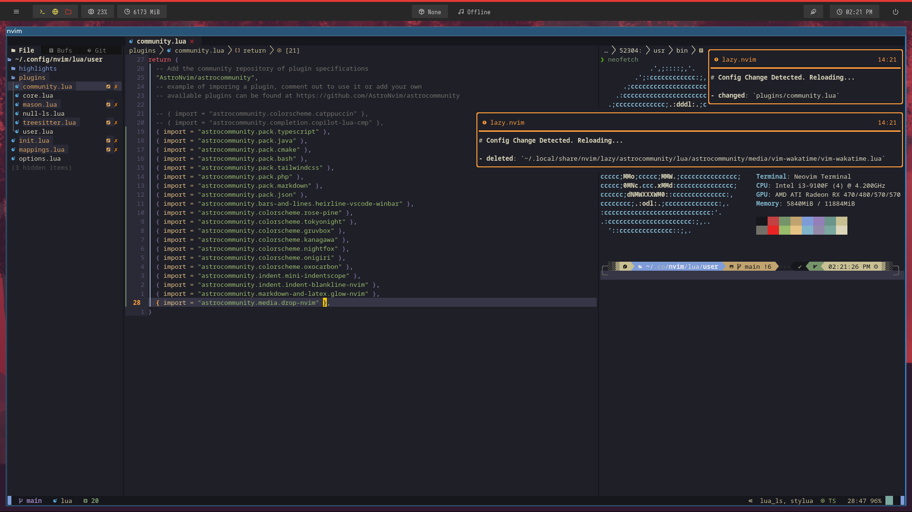

# Let's make vim awesome again!



- first remove the og gg vim `uninstall vim`
- Then install nvim in your machine `https://github.com/neovim/neovim/wiki/Installing-Neovim`

## 🛠️ Plugins Installation

#### Make a backup of your current nvim and shared folder

```shell
mv ~/.config/nvim ~/.config/nvim.bak
mv ~/.local/share/nvim ~/.local/share/nvim.bak
```

#### Clone AstroNvim

```shell
git clone https://github.com/AstroNvim/AstroNvim ~/.config/nvim nvim
```

#### Create a new user repository from this template

Press the "Use this template" button above to create a new repository to store your user configuration.

You can also just clone this repository directly if you do not want to track your user configuration in GitHub.

#### Clone the repository

```shell
git clone https://github.com/<your_user>/<your_repository> ~/.config/nvim/lua/user
```

#### Start Neovim

```shell
nvim
```
### Thats all you need to do, now you are ready to start your awesome coding projects 🫰 
